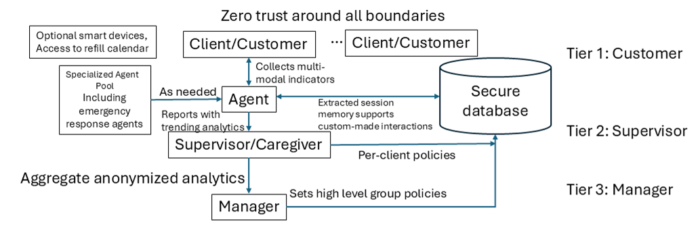

<p align="center">
  
  &nbsp;
  
  &nbsp;
  
</p>

# 🎉 Welcome to **SAGE: A Secure Agent Governance Ecosystem** 🎉

> **“Building Tomorrow’s Self-Learning, Self-Improving Agent Architectures—Securely and Seamlessly!”**

Dive into the future of AI‐driven organizational learning with **SAGE**, a **three‐tier architecture** designed to empower agents at every level—Customer, Supervisor, and Manager—while enforcing **zero‐trust security** and **privacy by design**! Explore our GitHub Pages site, browse the figure below, and discover how SAGE can transform use cases from elder‐care wellness to enterprise‐scale compliance.

---

## 🌟 SAGE Architecture at a Glance

<div align="center">
  
</div>

> **Figure 1.**  
> **Zero trust around all boundaries**: Client/Customer ↔ Tier 1 Agents ↔ Secure Database ↔ Tier 2 Supervisors ↔ Tier 3 Managers  
> *(Courtesy: May 2025 SAGE Research Paper, SMU-SAGE-research.pdf)*

---

## 🚀 Why SAGE?  

- **🔹 Three-Tier Learning Loop**  
  1. **Tier 1 – Customer/Client Agents**  
     - Directly engage your end-users (e.g., seniors, students, customers) via multi-modal interactions (voice calls, chatbots, smart‐device integration).  
     - Continuously collect sentiment, health metrics, or usage patterns.  
     - Decide autonomously when to escalate “as needed” to Supervisor Agents.  

  2. **Tier 2 – Supervisor/Caregiver Agents**  
     - Aggregate anonymized signals from dozens—or hundreds—of Client Agents.  
     - Provide trending analytics, cluster‐level coaching, and specialized prompts (e.g., “Diabetes Management Agent”).  
     - Enforce per-client policies pulled from a **Secure Database**—all under zero‐trust.  

  3. **Tier 3 – Manager/Policy Agents**  
     - Oversee system‐wide performance: “What percentage of our clients show elevated distress scores this month?”  
     - Adjust high‐level policies and escalation thresholds based on aggregated, de‐identified analytics.  
     - Interface with legal/compliance teams to guarantee HIPAA/GDPR readiness.  

- **🔹 Zero‐Trust Security**  
  - **End‐to‐End Encryption**: AES‐256 at rest, TLS 1.3 in transit.  
  - **Strict RBAC** (Role‐Based Access Control): Tier 2 sees only anonymized aggregates; Tier 3 sees only policy‐level reports.  
  - **Audit Logging & Consent Management**: Every call, every escalation, every policy change—all timestamped and auditable.

- **🔹 Extensible “Agent Pool”**  
  - **Emergency Agents** (911 triggers, crisis response).  
  - **Domain Specialists** (e.g., “Sleep & Circadian Rhythm Advisor,” “Cybersecurity Compliance Auditor”).  
  - **Smart Device Hooks**: Wearable integration for passive health metrics or telematics for IoT applications.

---

## 🎯 Key Features & Highlights

- **✨ Self-Improving Loops**  
  - Tier 1 agents learn from each client’s history.  
  - Tier 2 refines coaching strategies based on cluster trends.  
  - Tier 3 tunes global policies to optimize KPIs (e.g., wellness improvement, cost savings).

- **🛡 Privacy-First Design**  
  - **On‐Demand Data Purging**: Clients can revoke access at any time; raw transcripts are immediately zeroized after extraction of “distress flags.”  
  - **Minimal Exposure**: Only aggregated or abstracted scores flow upward.  
  - **HIPAA/GDPR/Zero-Trust**: Built‐in compliance ready for healthcare, finance, and any sensitive domain.

- **🌐 Universal Applicability**  
  - **Beyond Elder Care**: Education (tutor & curriculum agents), Retail (customer & supply‐chain agents), Government (citizen & policy agents), and more!  
  - **Plug-and-Play**: Drop in new specialized agents (Patent-Pending DRAGON algorithms for TDOA, specialized ML classifiers, quantum‐inspired similarity metrics).

- **⚙️ Open-Source Core + Marketplace Vision**  
  - **Apache 2.0 Licensed**: Core SAGE engine is fully open‐source and permissively licensed.  
  - **Future “Open API Market” Modules**: Monetize derivative capabilities, AI-mediated revenue sharing, and premium hosted services.  
  - **Patent-Friendly Foundation**: Explicit patent grants for contributors (via Apache 2.0), ensuring community trust and legal clarity.

---

## 🏁 Getting Started

1. **Clone this Repository**  
   ```bash
   git clone https://github.com/<your-username>/SAGE-Website.git
   cd SAGE-Website
# SAGE-Website

This repository contains the structure for the SAGE GitHub Pages site. Replace placeholder files as needed.
